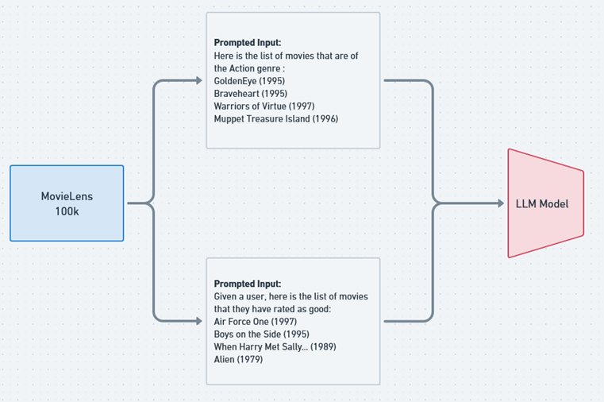

## LLM for Movie Recommendation

**Problem statement:** Build an LLM model that can interact in a chat-based manner to suggest comprehensive movie recommendations for you once you provide it with past data.

To enhance the accuracy of the language learning model (LLM) in providing movie recommendations, we are leveraging the MovieLens dataset. This dataset encompasses movie ratings from 942 users across 1,682 distinct movies. The strategy for fine-tuning the LLM is methodical and focuses on developing its ability to predict individual user preferences with higher precision.

 
The fine-tuning process involves the following steps:
 
1. Random Sampling of User Ratings: For each user, we randomly select six movie ratings. These ratings are binary, categorized as either 'good' or 'bad', providing a clear indication of the user's preference for each movie.
 
2. Model Training with Sampled Data: The LLM is then presented with five of these movies as input. The model's task is to analyze these five ratings and predict whether the user liked or disliked the sixth movie.
 
3. Comparative Analysis for Improvement: To evaluate the enhanced performance of the fine-tuned LLM, we employ a two-fold testing approach:
    - Baseline Model Comparison: The predictions made by the fine-tuned LLM are compared against those made by the baseline model. This comparison is crucial to determine the extent of improvement in the LLM's ability to understand and predict user preferences.
    - Average User Rating Predictions: Both the baseline and the fine-tuned models are used to predict average user ratings for movies. This test aims to assess how well each model can generalize its predictions across a broader range of movies and users.
 
This methodology not only sharpens the LLM's predictive capabilities but also ensures that the recommendations are tailored to individual tastes, potentially leading to a more personalized and satisfying movie-watching experience for the users.

To further refine the language learning model's (LLM) proficiency in movie recommendations, a second fine-tuning phase was introduced, this time incorporating genre information for each movie. This additional layer of data enrichment aims to provide a more nuanced understanding of user preferences, aligning them with specific cinematic genres. Here's how this enhanced fine-tuning process integrates genre information:
 
1. Incorporation of Genre Data: Alongside the binary ratings of 'good' or 'bad', each of the 100,000 data points in the MovieLens dataset now includes genre information for the 1,682 movies. This comprehensive genre tagging allows the LLM to recognize patterns and correlations between user preferences and specific movie genres.
 
2. Refined Model Training with Genre Information: Similar to the previous fine-tuning method, we randomly select six movie ratings from a user. However, now, in addition to the ratings, the LLM also receives the genre of each of these movies. The model is trained with five of these movies (and their genres), and then it predicts the user's preference for the sixth movie.
 
3. Enhanced Comparative Analysis: The evaluation of this genre-informed fine-tuned model involves:
    - Comparison with Previous Models: The predictions of this new model are compared against both the initial baseline model and the first fine-tuned version (without genre information). This comparison is essential to ascertain the impact of including genre information on the model's prediction accuracy.
    - Predicting Average User Ratings with Genre Consideration: The genre-informed model, along with the baseline and the first fine-tuned model, are used to predict average user ratings. This step assesses the overall effectiveness of including genre information in enhancing the model's capability to generalize across a diverse range of movies and user preferences.
 
By integrating genre details into the fine-tuning process, the LLM is expected to achieve a deeper understanding of user preferences, not just based on individual movie ratings but also considering their genre affinities. This approach aims to deliver more precise, genre-sensitive recommendations, thereby enriching the overall user experience in movie selection.
